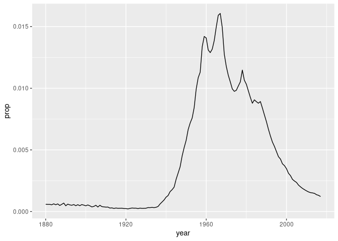

Transform Data
================

``` r
library(tidyverse)
```

    ## ── Attaching packages ──────────────────────────────────────────────────────────────────────────────────────────────────────── tidyverse 1.2.1 ──

    ## ✔ ggplot2 3.2.1     ✔ purrr   0.3.2
    ## ✔ tibble  2.1.3     ✔ dplyr   0.8.3
    ## ✔ tidyr   1.0.0     ✔ stringr 1.4.0
    ## ✔ readr   1.3.1     ✔ forcats 0.4.0

    ## ── Conflicts ─────────────────────────────────────────────────────────────────────────────────────────────────────────── tidyverse_conflicts() ──
    ## ✖ dplyr::filter() masks stats::filter()
    ## ✖ dplyr::lag()    masks stats::lag()

``` r
# install.packages("babynames")
library(babynames)
babynames
```

    ## # A tibble: 1,924,665 x 5
    ##     year sex   name          n   prop
    ##    <dbl> <chr> <chr>     <int>  <dbl>
    ##  1  1880 F     Mary       7065 0.0724
    ##  2  1880 F     Anna       2604 0.0267
    ##  3  1880 F     Emma       2003 0.0205
    ##  4  1880 F     Elizabeth  1939 0.0199
    ##  5  1880 F     Minnie     1746 0.0179
    ##  6  1880 F     Margaret   1578 0.0162
    ##  7  1880 F     Ida        1472 0.0151
    ##  8  1880 F     Alice      1414 0.0145
    ##  9  1880 F     Bertha     1320 0.0135
    ## 10  1880 F     Sarah      1288 0.0132
    ## # … with 1,924,655 more rows

# dplyr

## Your Turn 1

Alter the code to select just the `n` column:

``` r
select(babynames, name, prop)
```

    ## # A tibble: 1,924,665 x 2
    ##    name        prop
    ##    <chr>      <dbl>
    ##  1 Mary      0.0724
    ##  2 Anna      0.0267
    ##  3 Emma      0.0205
    ##  4 Elizabeth 0.0199
    ##  5 Minnie    0.0179
    ##  6 Margaret  0.0162
    ##  7 Ida       0.0151
    ##  8 Alice     0.0145
    ##  9 Bertha    0.0135
    ## 10 Sarah     0.0132
    ## # … with 1,924,655 more rows

## Quiz

Which of these is NOT a way to select the `name` and `n` columns
together?

``` r
select(babynames, -c(year, sex, prop))
```

    ## # A tibble: 1,924,665 x 2
    ##    name          n
    ##    <chr>     <int>
    ##  1 Mary       7065
    ##  2 Anna       2604
    ##  3 Emma       2003
    ##  4 Elizabeth  1939
    ##  5 Minnie     1746
    ##  6 Margaret   1578
    ##  7 Ida        1472
    ##  8 Alice      1414
    ##  9 Bertha     1320
    ## 10 Sarah      1288
    ## # … with 1,924,655 more rows

``` r
select(babynames, name:n)
```

    ## # A tibble: 1,924,665 x 2
    ##    name          n
    ##    <chr>     <int>
    ##  1 Mary       7065
    ##  2 Anna       2604
    ##  3 Emma       2003
    ##  4 Elizabeth  1939
    ##  5 Minnie     1746
    ##  6 Margaret   1578
    ##  7 Ida        1472
    ##  8 Alice      1414
    ##  9 Bertha     1320
    ## 10 Sarah      1288
    ## # … with 1,924,655 more rows

``` r
select(babynames, starts_with("n"))
```

    ## # A tibble: 1,924,665 x 2
    ##    name          n
    ##    <chr>     <int>
    ##  1 Mary       7065
    ##  2 Anna       2604
    ##  3 Emma       2003
    ##  4 Elizabeth  1939
    ##  5 Minnie     1746
    ##  6 Margaret   1578
    ##  7 Ida        1472
    ##  8 Alice      1414
    ##  9 Bertha     1320
    ## 10 Sarah      1288
    ## # … with 1,924,655 more rows

``` r
select(babynames, ends_with("n"))
```

    ## # A tibble: 1,924,665 x 1
    ##        n
    ##    <int>
    ##  1  7065
    ##  2  2604
    ##  3  2003
    ##  4  1939
    ##  5  1746
    ##  6  1578
    ##  7  1472
    ##  8  1414
    ##  9  1320
    ## 10  1288
    ## # … with 1,924,655 more rows

## Your Turn 2

Use `filter`, `babynames`, and the logical operators to find:

  - All of the names where prop is greater than or equal to 0.08  
  - All of the children named “Sea”

## Your Turn 3

Use Boolean operators to return only the rows that contain:

  - *Boys* named Sue  
  - Names that were used by exactly 5 or 6 children in 1880  
  - Names that are one of Acura, Lexus, or Yugo

## Help Me

What is the smallest value of n? What is the largest?

## Your Turn 4

Use `%>%` to write a sequence of functions that:

1.  Filters babynames to just the girls that were born in 2017,
    *then…*  
2.  Selects the `name` and `n` columns, *then…*  
3.  Arranges the results so that the most popular names are near the
    top.

## Your Turn 5 - Exam

1.  Trim `babynames` to just the rows that contain **your** `name` and
    **your** `sex`  
2.  Trim the result to just the columns that will appear in your graph
    (not strictly necessary, but useful practice)  
3.  Plot the results as a line graph with `year` on the x axis and
    `prop` on the y
axis

<!-- end list -->

``` r
select(babynames, name, sex, prop, year) %>% filter(name == 'Timothy', sex == 'M') -> my_name
ggplot(data = my_name)+
  geom_line(mapping = aes(x = year, y = prop))
```

<!-- -->

``` r
my_name
```

    ## # A tibble: 138 x 4
    ##    name    sex       prop  year
    ##    <chr>   <chr>    <dbl> <dbl>
    ##  1 Timothy M     0.000591  1880
    ##  2 Timothy M     0.000582  1881
    ##  3 Timothy M     0.000582  1882
    ##  4 Timothy M     0.000551  1883
    ##  5 Timothy M     0.000627  1884
    ##  6 Timothy M     0.000552  1885
    ##  7 Timothy M     0.000622  1886
    ##  8 Timothy M     0.000494  1887
    ##  9 Timothy M     0.000585  1888
    ## 10 Timothy M     0.000689  1889
    ## # … with 128 more rows

``` r
babynames %>% summarise(total = sum(n), max=max(n))
```

    ## # A tibble: 1 x 2
    ##       total   max
    ##       <int> <int>
    ## 1 348120517 99686

## Your Turn 6

Copmplete the code below to extract the rows where `name == "Khaleesi"`.
Then use `summarise()` and `sum()` and `min()` to find:

1.  The total number of children named Khaleesi
2.  The first year Khaleesi appeared in the data

*(Hint: Be sure to remove each `_` before running the code)*

``` r
babynames %>%
  filter(name == "Khaleesi") %>%
  summarise(total = sum(n), first = min(year))
```

    ## # A tibble: 1 x 2
    ##   total first
    ##   <int> <dbl>
    ## 1  1964  2011

``` r
babynames %>%
  filter(name == "Katniss") %>%
  summarise(total = sum(n))
```

    ## # A tibble: 1 x 1
    ##   total
    ##   <int>
    ## 1   137

## Your Turn 7

Use `group_by()`, `summarise()`, and `arrange()` to display the ten most
popular names. Compute popularity as the *total* number of children of a
single gender given a name.

*(Hint: Be sure to remove each `_` before running the code)*

``` r
babynames %>%
  group_by(name, sex) %>% 
  summarise(total = sum(n)) %>% 
  arrange(desc(total))
```

    ## # A tibble: 107,973 x 3
    ## # Groups:   name [97,310]
    ##    name    sex     total
    ##    <chr>   <chr>   <int>
    ##  1 James   M     5150472
    ##  2 John    M     5115466
    ##  3 Robert  M     4814815
    ##  4 Michael M     4350824
    ##  5 Mary    F     4123200
    ##  6 William M     4102604
    ##  7 David   M     3611329
    ##  8 Joseph  M     2603445
    ##  9 Richard M     2563082
    ## 10 Charles M     2386048
    ## # … with 107,963 more rows

``` r
  #ggplot()+
   # geom_col(mapping =aes(x=names, y=total, fill=sex))
```

## Your Turn 8

Fill in the blanks to: Rank each name *within its year and sex*.

*(Hint: Be sure to remove each `_` before running the code)*

``` r
babynames %>% 
  group_by(year, sex) %>% 
  mutate(rank = min_rank(desc(prop)))
```

    ## # A tibble: 1,924,665 x 6
    ## # Groups:   year, sex [276]
    ##     year sex   name          n   prop  rank
    ##    <dbl> <chr> <chr>     <int>  <dbl> <int>
    ##  1  1880 F     Mary       7065 0.0724     1
    ##  2  1880 F     Anna       2604 0.0267     2
    ##  3  1880 F     Emma       2003 0.0205     3
    ##  4  1880 F     Elizabeth  1939 0.0199     4
    ##  5  1880 F     Minnie     1746 0.0179     5
    ##  6  1880 F     Margaret   1578 0.0162     6
    ##  7  1880 F     Ida        1472 0.0151     7
    ##  8  1880 F     Alice      1414 0.0145     8
    ##  9  1880 F     Bertha     1320 0.0135     9
    ## 10  1880 F     Sarah      1288 0.0132    10
    ## # … with 1,924,655 more rows

-----

# Take aways

  - Extract variables with `select()`  

  - Extract cases with `filter()`  

  - Arrange cases, with `arrange()`

  - Make tables of summaries with `summarise()`  

  - Make new variables, with `mutate()`  

  - Do groupwise operations with `group_by()`

  - Connect operations with `%>%`
